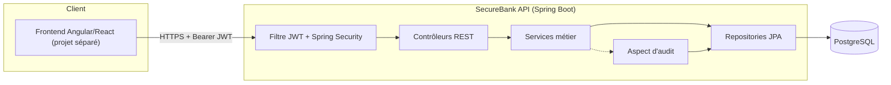

# SecureBank API

API bancaire de démonstration (comptes, virements, authentification forte) construite comme
exemple de projet pour illustrer une architecture Full Stack **sécurisée dès la conception**,
conforme aux principes **OWASP** et aux exigences de contrôle inspirées de **PCI-DSS**.

> Projet réalisé par **Junior Tsafack Megnekeu** ([blog.jtmcloud.com](https://blog.jtmcloud.com) ·
> [GitHub](https://github.com/Julionores) ·
> [LinkedIn](https://www.linkedin.com/in/junior-tsafack-megnekeu-b673151b9)), à titre d'exemple de
> projet technique orienté banque/finance (Full Stack, DevSecOps, sécurité applicative).

## Pourquoi ce projet

La plupart des démonstrateurs "CRUD bancaire" qu'on trouve en ligne ignorent les contraintes qui
font la vraie difficulté d'un système financier : cohérence des soldes sous concurrence, contrôle
d'accès strict par ressource, traçabilité complète des opérations, et absence totale de fuite
d'information technique vers le client. SecureBank API traite ces contraintes comme des exigences
de premier ordre plutôt que comme un "bonus sécurité" ajouté après coup.

## Fonctionnalités

- Inscription et authentification par JWT, avec politique de mot de passe renforcée (OWASP ASVS)
  et limitation des tentatives de connexion (anti brute-force).
- Consultation des comptes du client authentifié uniquement (contrôle d'accès au niveau objet —
  protection contre les IDOR).
- Virements inter-comptes atomiques avec verrouillage pessimiste en base pour empêcher tout
  dépassement de solde en cas de virements concurrents.
- Dépôts et retraits sur un compte (simulation d'un versement ou d'un retrait externe),
  avec les mêmes garanties d'atomicité que les virements.
- Historique des transactions paginé.
- Journal d'audit automatique (via AOP) de toute action sensible : authentification, virement,
  tentative d'accès refusée.
- Documentation API interactive (OpenAPI/Swagger).

## Architecture



Découpage en couches classique (contrôleur → service → repository) avec deux préoccupations
transverses appliquées par aspect plutôt que dispersées dans le code métier : la sécurité
(filtre JWT) et l'audit (AOP). Le domaine (`User`, `Account`, `Transaction`, `AuditLog`) est
volontairement simple mais respecte les invariants d'un vrai système comptable : montants en
`BigDecimal`, écritures immuables, référence de corrélation entre les deux lignes d'un virement.

## Pile technique

| Domaine | Choix |
|---|---|
| Langage / Framework | Java 21, Spring Boot 3.3 |
| Sécurité | Spring Security 6, JWT (jjwt), BCrypt |
| Persistance | Spring Data JPA, PostgreSQL, Flyway |
| Documentation API | springdoc-openapi (Swagger UI) |
| Tests | JUnit 5, Mockito, AssertJ, MockMvc, H2 |
| Conteneurisation | Docker multi-stage, Docker Compose |
| CI/CD | GitHub Actions (build, tests, SAST, SCA, scan d'image) |

## Démarrage local

```bash
cp .env.example .env   # renseigner DB_PASSWORD et JWT_SECRET
docker compose up --build
```

L'API est alors disponible sur `http://localhost:8080`, la documentation interactive sur
`http://localhost:8080/swagger-ui/index.html`.

Sans Docker :

```bash
export DB_URL=jdbc:postgresql://localhost:5432/securebank
export DB_USERNAME=securebank
export DB_PASSWORD=...
export JWT_SECRET=...   # 32 caractères minimum
mvn spring-boot:run
```

## Tests

```bash
mvn clean verify
```

Inclut des tests unitaires sur le cœur métier des virements et des dépôts/retraits (impossibilité
de passer en solde négatif, contrôle de propriété d'un compte) et un test d'intégration
bout-en-bout de l'authentification (H2 en mémoire, sans dépendance à PostgreSQL).

## Points d'API principaux

| Méthode | Route | Description | Authentification |
|---|---|---|---|
| POST | `/api/v1/auth/register` | Créer un compte client | Non |
| POST | `/api/v1/auth/login` | Obtenir un jeton JWT | Non |
| GET | `/api/v1/accounts` | Lister mes comptes | Oui |
| GET | `/api/v1/accounts/{id}` | Détail d'un de mes comptes | Oui |
| POST | `/api/v1/transfers` | Effectuer un virement | Oui |
| POST | `/api/v1/accounts/{id}/deposits` | Déposer des fonds sur un compte | Oui |
| POST | `/api/v1/accounts/{id}/withdrawals` | Retirer des fonds d'un compte | Oui |
| GET | `/api/v1/accounts/{id}/transactions` | Historique paginé | Oui |

## Sécurité

Le détail des contrôles appliqués et leur correspondance avec l'OWASP Top 10 / PCI-DSS est
documenté dans [`SECURITY.md`](SECURITY.md).

## Feuille de route

- [ ] Authentification multi-facteurs (TOTP)
- [ ] Chiffrement applicatif des champs les plus sensibles (au-delà du chiffrement au repos de la base)
- [ ] Migration progressive vers une architecture événementielle (Kafka) pour le traitement des
      virements — voir le projet compagnon "architecture événementielle bancaire"
- [ ] Frontend Angular de démonstration consommant cette API

## Licence

MIT — voir [`LICENSE`](LICENSE). Projet à but pédagogique et de démonstration ; ne pas utiliser
tel quel pour traiter de vrais fonds ou de vraies données personnelles.
